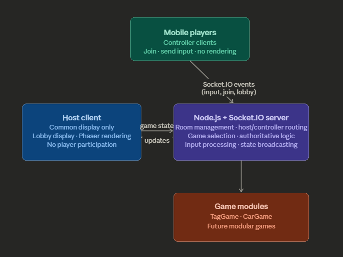

## 🧩 System Architecture

### 📱 Mobile Players (Controllers)
- Act as input devices
- Join a room and send input events only
- Do not render gameplay
- Do not execute authoritative game logic

---

### 🖥️ Host Client (Display)
- Single shared display (TV / Laptop)
- Renders lobby and gameplay using Phaser
- Receives state updates from the server
- Does not control player movement directly
- Does not own gameplay state

---

### ⚙️ Node.js + Socket.IO Server
- Handles room creation and joining
- Differentiates host and controller roles
- Receives and validates player inputs
- Runs the server-side game loop
- Loads and manages game modules
- Maintains authoritative game state
- Processes movement, collisions, scoring, pause/resume, and winner detection
- Broadcasts state updates to host and relevant clients

---

### 🎮 Game Modules
- Modular game system
- Current:
  - Paint Game
  - Racer Game
- Easily extendable for future games
- Each game follows a common structure for initialization, updates, input handling, and state retrieval

---

### 🔄 Communication Flow
- Mobile Controllers → Server: movement and action inputs
- Host Client → Server: room creation, game selection, and game start events
- Server → Host Client: lobby state and gameplay state updates
- Server → Controllers: join confirmations, room status, and game-related notifications
- All authoritative game logic is executed on the server

---

### 🧠 Architectural Summary
The platform follows a **server-authoritative host-controller architecture**. Mobile devices act as controllers, the server manages all authoritative gameplay state, and the host client acts as the shared visual display for the multiplayer session.