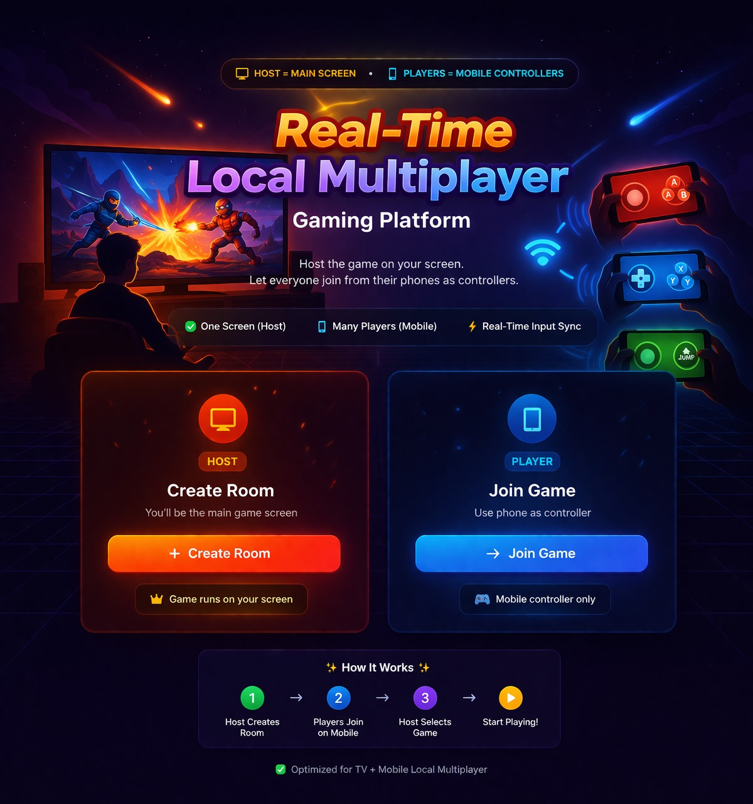
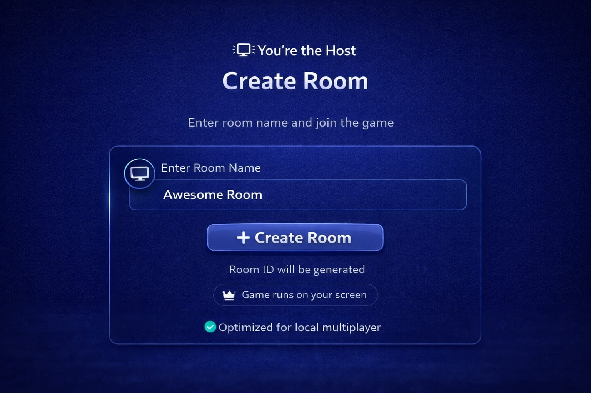
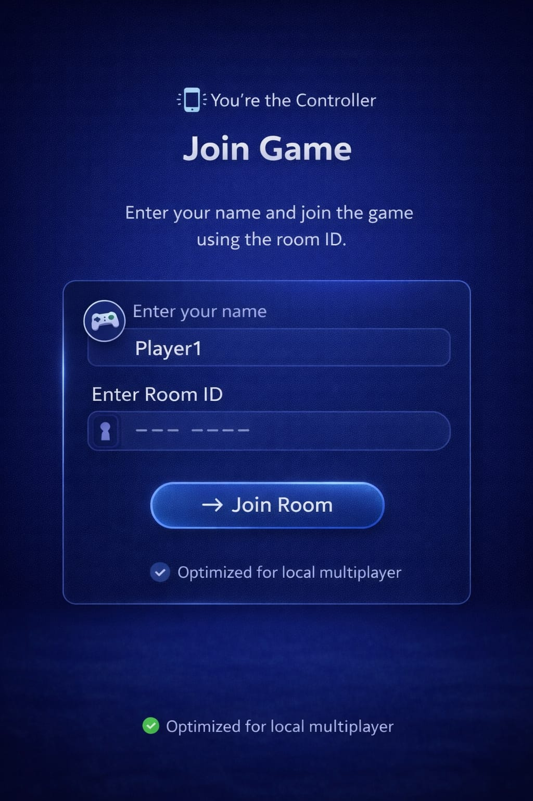
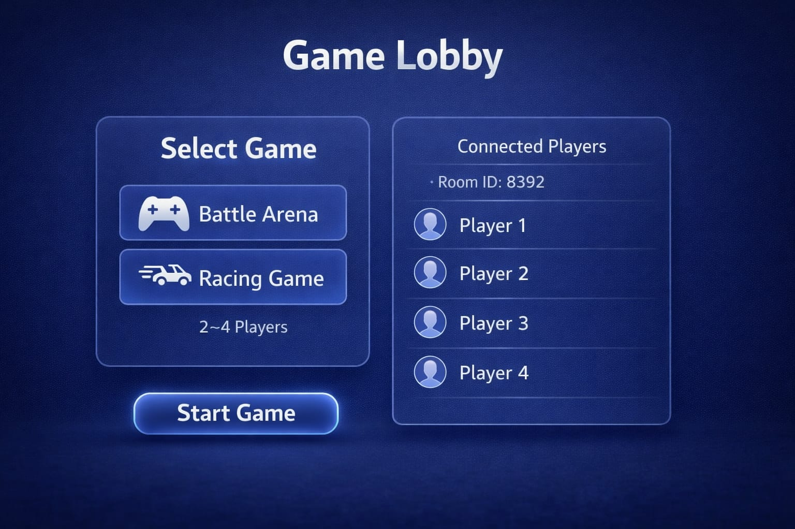

## 🎨 GUI Wireframes

### 🏠 Home Screen (Entry Point)

- Users choose their role:
  - **Host** → Main display (TV/Laptop)
  - **Player** → Mobile controller
- Key features:
  - One screen gameplay (Host)
  - Multiple mobile controllers
  - Real-time input synchronization

---

### 🖥️ Host Flow – Create Room

- Host enters room name
- System generates unique Room ID
- Host becomes the main display
- Game rendering happens only on host screen

**Key Actions:**
- Create Room
- Wait for players to join

---

### 📱 Player Flow – Join Game

- Player enters:
  - Name
  - Room ID
- Joins as a controller (no rendering)

**Key Actions:**
- Join Room
- Send input to server

---

### 🎮 Game Lobby

- Host selects game:
  - Battle Arena
  - Racing Game
- Displays connected players
- Supports 2–4 players

**Key Features:**
- Real-time player list
- Game selection system
- Start game control (host only)

---

### 🔄 Interaction Flow

1. Host creates a room  
2. Players join via mobile  
3. Host selects game  
4. Game starts with real-time input sync  

---

### 🧠 Design Concept

- **Single Rendering Screen** → Reduces device load  
- **Mobile as Controllers** → Easy multiplayer setup  
- **Authoritative Server Model** → Prevents desync  
- **Modular Game UI** → Supports multiple games  
