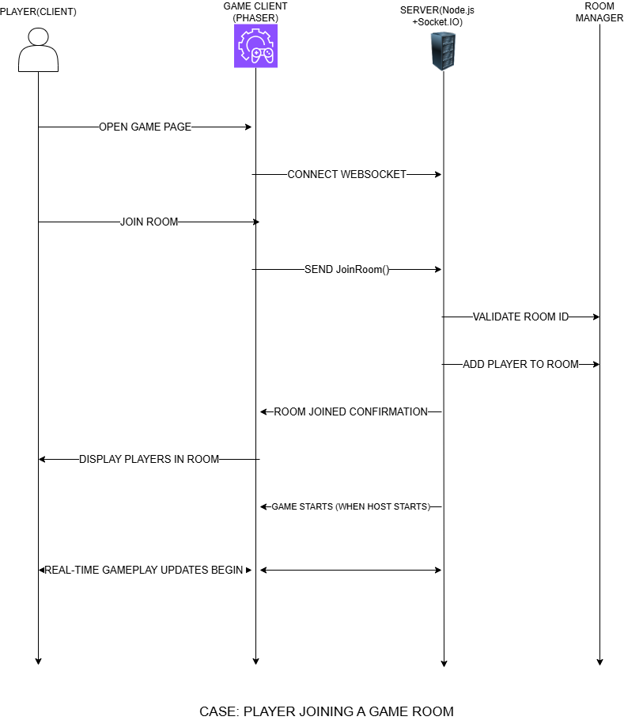
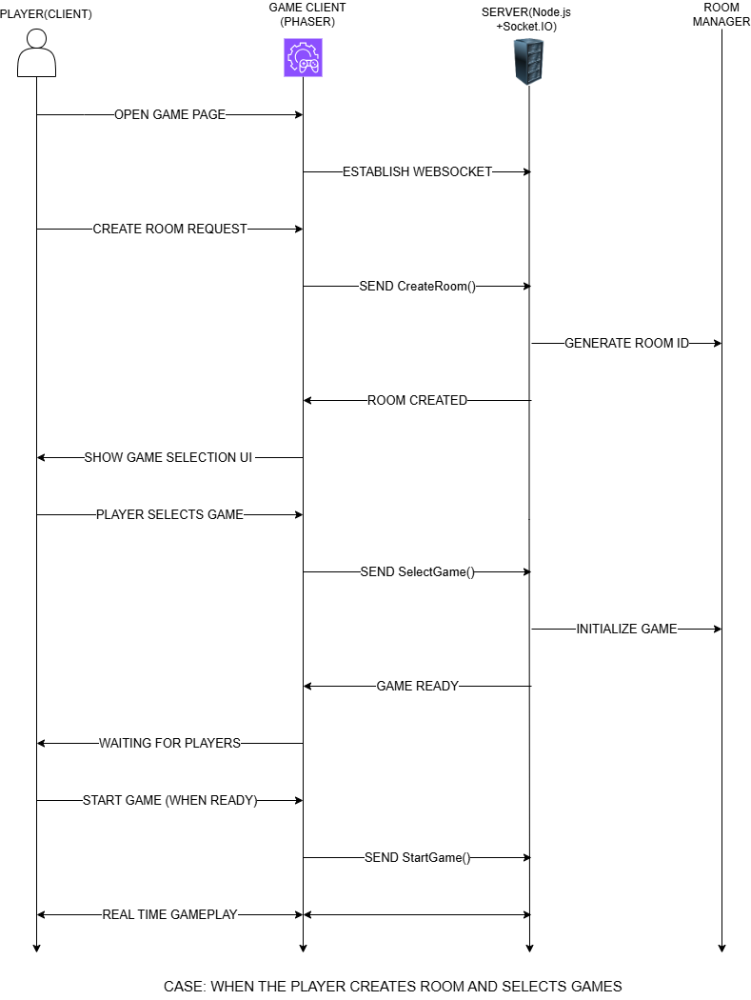

# Step 6: Behavioral Logic – Sequence Diagrams

## 📌 Overview

This section describes the behavioral flow of the system using sequence diagrams. These diagrams illustrate how different components interact over time for key operations such as:

* Player joining a room
* Host creating a room and selecting a game

This fulfills the requirement of Step 6 in the SDLC process .

---

## 🧠 System Architecture Roles

The system follows a **host-controller architecture**:

### 🖥️ Host (Game Client – Phaser)

* Runs the game using Phaser.js
* Handles all game logic (movement, collision, scoring)
* Acts as the main display screen
* Does NOT participate as a player

---

### 📱 Players (Mobile Clients)

* Join rooms using Room ID
* Act as controllers only
* Send input events (e.g., move, action)
* Do NOT render the game

---

### 🧠 Server (Node.js + Socket.IO)

* Handles WebSocket connections
* Manages communication between clients
* Routes player inputs to host
* Maintains room state

---

### 🏠 Room Manager

* Creates and manages rooms
* Validates Room IDs
* Adds/removes players
* Maintains player lists

---

## 🎮 Use Case 1: Player Joining a Game Room

### 📷 Diagram

---

### 🔄 Flow Description

1. Player opens the game page
2. Client connects to server via WebSocket
3. Player sends **Join Room request**
4. Server receives request and forwards to Room Manager
5. Room Manager:

   * Validates Room ID
   * Adds player to the room
6. Server sends **Room Joined confirmation**
7. Client displays updated player list
8. When host starts the game → gameplay begins
9. Real-time updates start

---

### ✅ Key Observations

* Players are mobile devices acting as controllers
* No game logic runs on player devices
* Server ensures valid room joining
* Host screen reflects all gameplay

---

## 🎮 Use Case 2: Host Creates Room and Selects Game

### 📷 Diagram

---

### 🔄 Flow Description

1. Host opens the game page
2. WebSocket connection is established
3. Host sends **Create Room request**
4. Server:

   * Generates a unique Room ID
   * Creates room via Room Manager
5. Server sends **Room Created confirmation**
6. Host UI shows **Game Selection screen**
7. Host selects a game
8. Client sends **Select Game event**
9. Server initializes the selected game module
10. System enters waiting state for players
11. Host starts the game when ready
12. Real-time gameplay begins

---

### ✅ Key Observations

* Host is NOT a player
* Host only controls and displays the game
* Game modules are dynamically loaded
* Supports modular game architecture

---

## 🔁 Real-Time Gameplay Flow

Once the game starts:

1. Players send input → Server
2. Server forwards input → Host
3. Host processes input and updates game state
4. Updates are reflected on host screen

---

## 🧠 Architectural Highlights

* Event-driven communication using Socket.IO
* Clear separation of responsibilities:

  * UI (Client)
  * Game Logic (Host)
  * Communication (Server)
* Modular design allows adding new games easily

---

## ⚠️ Important Design Decisions

* Host is not part of player list
* Only mobile users are counted as players
* Game logic runs only on host
* Controllers send input only (no rendering)

---

## 🚀 Conclusion

The sequence diagrams demonstrate how the system handles:

* Room creation
* Game selection
* Player joining
* Real-time gameplay

These interactions ensure a smooth and scalable multiplayer experience using a host-controller architecture.
