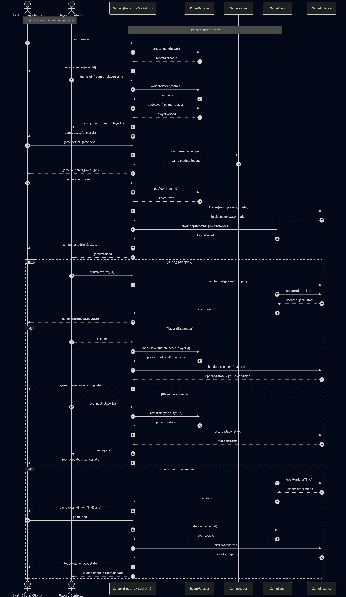

# Step 6: Behavioral Logic – Sequence Diagram

## 📌 Overview

This section describes the behavioral flow of the **WebSocket-Based Modular Multiplayer Game Platform** using a sequence diagram.

The platform follows a **server-authoritative host-controller architecture** in which:

- the **Server** owns and updates the authoritative game state
- the **Host** acts as the shared display client
- the **Players** act as controller clients and send input only

The sequence diagram covers the complete system flow:

- room creation
- player joining
- game selection
- game start
- real-time gameplay
- disconnect and reconnect handling
- game over and session end

---

## 🧠 System Components

### 🖥️ Host (Display Client)
- Creates the room
- Selects the game
- Starts the game
- Receives updated game state from the server
- Renders lobby and gameplay on the shared screen
- Displays the final result
- Ends the session using `game:end`

---

### 📱 Player / Controller
- Joins a room using Room ID
- Sends movement or action inputs
- Does not render gameplay
- Does not directly modify game state

---

### ⚙️ Server (Node.js + Socket.IO)
- Handles socket communication
- Coordinates room and game events
- Validates and routes player input
- Maintains authoritative gameplay state
- Sends state updates to clients

---

### 🏠 RoomManager
- Creates rooms
- Validates room IDs
- Adds and removes players
- Stores room membership and session details
- Handles reconnect and disconnect state

---

### 🎮 GameLoader
- Loads the selected game module dynamically

---

### 🔁 GameLoop
- Runs continuously while the game is active
- Calls update logic repeatedly
- Produces updated state snapshots

---

### 🕹️ GameInstance
- Contains game-specific rules and logic
- Handles input processing
- Applies movement, collisions, scoring, and win conditions
- Determines the winner

---

## 🎮 Sequence Diagram

---

## 🔄 Flow Description

### 1. Room Creation

1. The **Host** sends `room:create` to the **Server**
2. The **Server** requests the **RoomManager** to create a room
3. The **RoomManager** generates a unique Room ID
4. The **Server** sends `room:created(roomId)` back to the **Host**

**Result:**  
A new room is created and the host receives the Room ID.

---

### 2. Player Joining

1. A **Player** sends `room:join(roomId, playerName)` to the **Server**
2. The **Server** asks the **RoomManager** to validate the room
3. The **RoomManager** adds the player to the room
4. The **Server** sends `room:joined(roomId, playerId)` to the **Player**
5. The **Server** sends `room:update(playerList)` to the **Host**

**Result:**  
The player joins successfully, and the host lobby is updated.

---

### 3. Game Selection

1. The **Host** sends `game:select(gameType)` to the **Server**
2. The **Server** requests the **GameLoader** to load the selected game module
3. The **GameLoader** returns the required module
4. The **Server** sends `game:selected(gameType)` to the **Host**

**Result:**  
The selected game module is prepared on the server.

---

### 4. Game Start

1. The **Host** sends `game:start(roomId)` to the **Server**
2. The **Server** retrieves room details from the **RoomManager**
3. The **Server** initializes the **GameInstance**
4. The **GameInstance** returns the initial game state
5. The **Server** starts the **GameLoop**
6. The **Server** sends `game:started(initialState)` to the **Host**
7. The **Server** sends `game:started` to the connected **Players**

**Result:**  
The session enters active gameplay and the server begins the authoritative update cycle.

---

### 5. Real-Time Gameplay

During gameplay, the following cycle repeats continuously:

1. A **Player** sends `input:move(dx, dy)` to the **Server**
2. The **Server** forwards the input to the **GameInstance**
3. The **GameLoop** repeatedly calls `update(deltaTime)` on the **GameInstance**
4. The **GameInstance** updates positions, collisions, scores, and rules
5. The **GameInstance** returns the updated state
6. The **GameLoop** passes the latest state snapshot to the **Server**
7. The **Server** sends `game:state(updatedState)` to the **Host**
8. The **Host** renders the updated gameplay state

**Important:**  
- Players send **input only**
- Host performs **rendering only**
- Server owns and updates the game state

---

### 6. Disconnect and Reconnect Handling

#### Player Disconnect

1. The **Player** disconnects from the **Server**
2. The **Server** informs the **RoomManager**
3. The **RoomManager** marks the player as disconnected
4. The **Server** informs the **GameInstance**
5. The **GameInstance** updates gameplay state or pause condition
6. The **Server** notifies the **Host** using pause or room update information

#### Player Reconnect

1. The **Player** reconnects using the same identity
2. The **Server** asks the **RoomManager** to restore the player
3. The **RoomManager** restores the player session
4. The **Server** informs the **GameInstance**
5. The **GameInstance** restores the player state
6. The **Server** sends rejoin confirmation to the **Player**
7. The **Server** sends updated room or game state to the **Host**

**Result:**  
Temporary disconnections are handled without giving authority to any client.

---

### 7. Game Over and Session End

1. The **GameLoop** continues calling updates on the **GameInstance**
2. The **GameInstance** determines the winner
3. The **GameInstance** returns the final authoritative state
4. The **Server** sends `game:over(winner, finalState)` to the **Host** only
5. The **Host** displays the result on the shared screen
6. The **Host** sends `game:end` to the **Server**
7. The **Server** stops the **GameLoop**
8. The **Server** resets or prepares the **GameInstance** for the next session
9. The **Server** sends updated lobby or room state to connected clients

**Result:**  
The game ends cleanly and the system transitions back to lobby-ready state.

---

## ✅ Key Design Observations

- The system is **server-authoritative**
- The **Host is not a player**
- Mobile clients act only as **controllers**
- All gameplay logic runs on the **Server**
- The **GameLoop** and **GameInstance** enforce gameplay behavior on the server side
- The **Host** only renders server-provided state
- `game:over` is sent only to the **Host**
- `game:end` is used to terminate the active session and reset the game state

---

## 🚀 Conclusion

The sequence diagram demonstrates the complete interaction between the **Host**, **Player**, **Server**, **RoomManager**, **GameLoader**, **GameLoop**, and **GameInstance** in a **server-authoritative multiplayer architecture**.

This design ensures:

- centralized state control
- reduced cheating possibilities
- clean separation between input, logic, and rendering
- modular game integration
- reliable synchronization across room-based multiplayer sessions